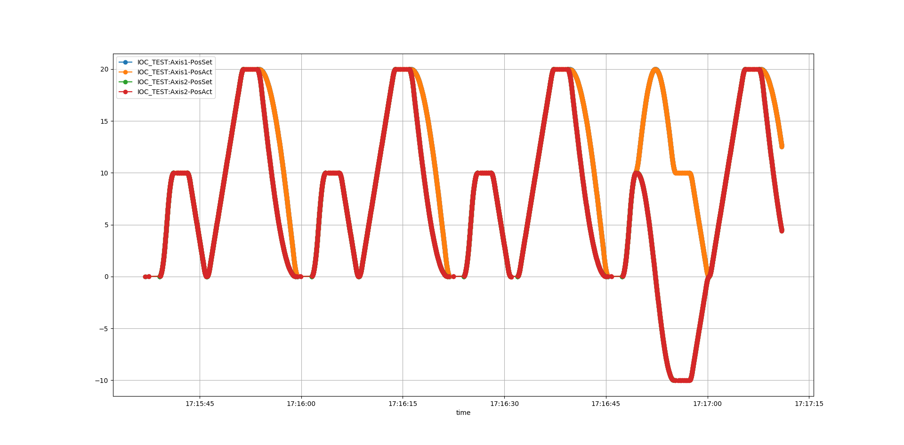
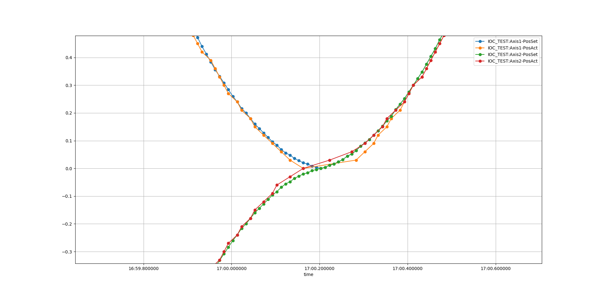
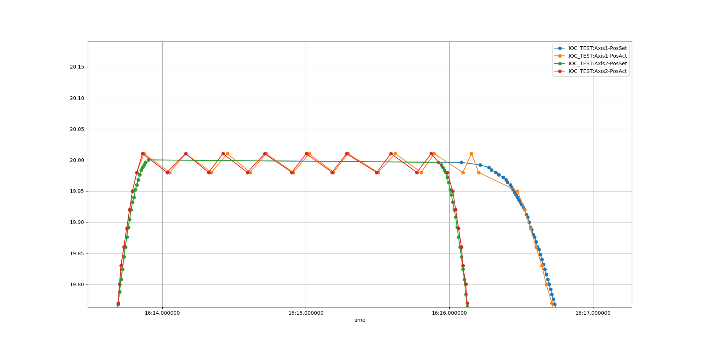

# ecmc_plugin_grbl: Nc g-code support for ecmc

ecmc plugin for cnc g-code execution by grbl.
The plugin supports 3 axes (x,y,z) and spindle.

More info can found in the grbl [readme](README_grbl.md) however not all features are supported.

# Supported features

Most, but not all, of the grbl features should be supported but not all have been tested.

## Grbl features
grbl v1.1 supports the following features: 
```
List of Supported G-Codes in Grbl v1.1:
  - Non-Modal Commands: G4, G10L2, G10L20, G28, G30, G28.1, G30.1, G53, G92, G92.1
  - Motion Modes: G0, G1, G2, G3, G38.2, G38.3, G38.4, G38.5, G80
  - Feed Rate Modes: G93, G94
  - Unit Modes: G20, G21
  - Distance Modes: G90, G91
  - Arc IJK Distance Modes: G91.1
  - Plane Select Modes: G17, G18, G19
  - Tool Length Offset Modes: G43.1, G49
  - Cutter Compensation Modes: G40
  - Coordinate System Modes: G54, G55, G56, G57, G58, G59
  - Control Modes: G61
  - Program Flow: M0, M1, M2, M30*
  - Coolant Control: M7*, M8, M9
  - Spindle Control: M3, M4, M5
  - Valid Non-Command Words: F, I, J, K, L, N, P, R, S, T, X, Y, Z
```

## Tested features

* G0, G1, G2, G3, G4
* G4
* M3, M4, M5
* S

## Not supported features
Some of the grbl features are not suppored (yet).

### Grbl limit switch evaluation
Limit switches are handled by ecmc. If an limit switch is engaged all control will be taken over by ecmc and the grbl plugin will go into error state.

### Grbl homing sequences
Homing sequences needs to be handled in ecmc prior to execution of any g-code. This since ecmc handles the limit switches.

### Grbl coolant control
Not supported yet

### Grbl probing 
Not supported yet

### Grbl Softlimits
Grbl softlimits are not supported. This should be handled in ecmc.

# Configuration and programming

The plugin contains two command buffers:
* Plugin configuration
* Grbl configuration buffer (for setup of the system)
* Grbl programming buffer (nc g-code)

## Plugin configuration

### Load of plugin

The plugin must be loaded into ecmc with the *loadPlugin.cmd* command.
Exmaple of loading of plugin
```
epicsEnvSet("PLUGIN_VER" ,"develop")
require ecmc_plugin_grbl $(PLUGIN_VER)
epicsEnvSet(ECMC_PLUGIN_FILNAME,"/home/pi/epics/base-7.0.5/require/${E3_REQUIRE_VERSION}/siteMods/ecmc_plugin_grbl/$(PLUGIN_VER)/lib/${EPICS_HOST_ARCH=linux-x86_64}/libecmc_plugin_grbl.so")
epicsEnvSet(ECMC_PLUGIN_CONFIG,"DBG_PRINT=1;X_AXIS=1;Y_AXIS=2;SPINDLE_AXIS=3;AUTO_ENABLE=0;AUTO_START=0;")
${SCRIPTEXEC} ${ecmccfg_DIR}loadPlugin.cmd, "PLUGIN_ID=0,FILE=${ECMC_PLUGIN_FILNAME},CONFIG='${ECMC_PLUGIN_CONFIG}', REPORT=1"
```
The configuration string contains the following configuration commands:

* DBG_PRINT    *1/0: enable/disable debug printouts*
* X_AXIS       *ecmc axis id that will be used as x-axis*
* Y_AXIS       *ecmc axis id that will be used as y-axis*
* Z_AXIS       *ecmc axis id that will be used as z-axis*
* SPINDLE_AXIS *ecmc axis id that will be used as spindle-axis*
* AUTO_ENABLE  *1/0: auto enable all configured axis before nc code is triggered*
* AUTO_START   *1/0: auto start g-code nc program at ioc start*

### ecmc plc functions

#### grbl_set_execute(arg0)
```
 double grbl_set_execute(<exe>) :  Trigg execution of loaded g-code at positive edge of <exe>
```

#### grbl_mc_halt(arg0)
```
double grbl_mc_halt(<halt>) :  Halt grbl motion at positive edge of <halt>
```

#### grbl_mc_resume(arg0)
```
double grbl_mc_resume(<resume>) : Resume halted grbl motion at positive edge of <resume>
```

#### grbl_get_busy()
```
double grbl_get_busy() :  Get grbl system busy (still executing motion code)
```

#### grbl_get_parser_busy()
```
double grbl_get_parser_busy() :  Get g-code parser busy.
```

#### grbl_get_code_row_num()
```
double grbl_get_code_row_num() :  Get g-code row number currently preparing for exe.
```

#### grbl_get_error()
```
double grbl_get_error() :  Get error code.
```

#### grbl_reset_error()
```
double grbl_reset_error() :  Reset error.
```

#### grbl_get_all_enabled()
```
double grbl_get_all_enabled() :  Get all configured axes enabled.
```

#### grbl_set_all_enable(arg0)
```
double grbl_set_all_enable(enable) : Set enable on all configured axes.
```

## Grbl Configuration
A subset of the [grbl configuration comamnds](doc/markdown/settings.md) is supported:

```
* $11 - Junction deviation, mm
* $12 – Arc tolerance, mm
* $30 - Max spindle speed, RPM
* $31 - Min spindle speed, RPM
* $100, $101 and $102 – [X,Y,Z] steps/mm
* $110, $111 and $112 – [X,Y,Z] Max rate, mm/min
* $120, $121, $122 – [X,Y,Z] Acceleration, mm/sec^2

Example: Set Max spindle speed to 1000rpm
$30=1000
```
### Loading of grbl configuration

Loading of grbl configuration can be done by issuing the following iocsh cmds:
* ecmcGrblLoadConfigFile(*filename*)
* ecmcGrblAddConfig(*command*)
These commands can only be used before iocInit().
At iocInit() these configurationd will be written to grbl.

#### ecmcGrblLoadConfigFile(filename)
The ecmcGrblLoadConfigFile(*filename*) command loads a file containing grbl configs:

```
ecmcGrblLoadConfigFile -h

       Use ecmcGrblLoadConfigFile(<filename>,<append>)
          <filename>             : Filename containg grbl configs.
          <append>               : 0: clear all current configs in buffer before 
                                     loading file (default).
                                 : 1: append commands in file last in buffer. (grbl is not reset)

```

Example:
```
ecmcGrblLoadConfigFile("./cfg/grbl.cfg")
```
#### ecmcGrblAddConfig(command);

The ecmcGrblAddConfig(*command*) adds one configuration command to the configuration buffer:

```
ecmcGrblAddConfig -h

       Use ecmcGrblAddConfig(<command>)
          <command>                      : Grbl command.

       Supported grbl comamnds:
          $11 - Junction deviation, mm
          $12 – Arc tolerance, mm
          $30 - Max spindle speed, RPM
          $31 - Min spindle speed, RPM
          $100, $101 and $102 – [X,Y,Z] steps/mm
          $110, $111 and $112 – [X,Y,Z] Max rate, mm/min
          $120, $121, $122 – [X,Y,Z] Acceleration, mm/sec^2

       Example: Set resolution to 1 micrometer
        ecmcGrblAddConfig("$100=1000")  

```

Example: Set X acceleration to 100mm/sec²
```
ecmcGrblAddConfig("$120=100")
```

## Grbl programming

### Loading of grbl g-code nc programs

Loading of grbl g-code nc programs can be done by issuing the following iocsh cmds:
* ecmcGrblLoadGCodeFile(*filename*,*append*)
* ecmcGrblAddCommand(*command*)

#### ecmcGrblLoadGCodeFile(filename, append)
The ecmcGrblLoadGCodeFile(*filename*, *append*) command loads a file containing nc code.
If *append* parameter is set then the code in the file will be appended to any previous added nc code in the program buffer,
otherwise the nc code program buffer will be cleared before adding the contents of the file.

```
ecmcGrblLoadGCodeFile -h

       Use ecmcGrblLoadGCodeFile(<filename>,<append>)
          <filename>             : Filename containg g-code.
          <append>               : 0: reset grbl, clear all current commands in buffer before 
                                     loading file (default).
                                 : 1: append commands in file last in buffer. (grbl is not reset)

```

Example: Load file without append
```
ecmcGrblLoadGCodeFile("./plc/gcode.nc",0)
```

#### ecmcGrblAddCommand(command);

The ecmcGrblAddCommand(*command*) adds one nc command to the program buffer:

```
ecmcGrblAddCommand -h

       Use ecmcGrblAddCommand(<command>)
          <command>                      : Grbl command.

```

Example: Add nc g-code command
```
ecmcGrblAddCommand("G1X20Y20F360")
```

# Test script

A [test script](test.script) can be found in the iocsh directory.

The test script includes the following:
* Configuration of three axes as [X](iocsh/cfg/x.ax),[Y](iocsh/cfg/y.ax) and [spindle](iocsh/cfg/spindle.ax)
* Needed sync expression files for [X](iocsh/cfg/x.sax) and [Y](iocsh/cfg/y.sax) (spindle does not need sync file)
* [Grbl configuration file](iocsh/cfg/grbl.cfg)
* [Plc file](iocsh/plc/grbl.plc)
* [Nc g-code file](iocsh/plc/g-code.nc)

The plc-file is used to retrigger the nc g-code after it has been finalized.
 
# Pictures
Some pictures of x and y actual and setpoints for G0,G1,G2,G4 commands:
* X = Axis1
* Y = Axis2

## X and Y positions 


## Detail 1


## Detail 2


# Plugin info
```
Plugin info: 
  Index                = 0
  Name                 = ecmcPluginGrbl
  Description          = grbl plugin for use with ecmc.
  Option description   = 
    DBG_PRINT=<1/0>    : Enables/disables printouts from plugin, default = disabled (=0).
      X_AXIS=<axis id>: Ecmc Axis id for use as grbl X axis, default = disabled (=-1).
      Y_AXIS=<axis id>: Ecmc Axis id for use as grbl Y axis, default = disabled (=-1).
      Z_AXIS=<axis id>: Ecmc Axis id for use as grbl Z axis, default = disabled (=-1).
      SPINDLE_AXIS=<axis id>: Ecmc Axis id for use as grbl spindle axis, default = disabled (=-1).
      AUTO_ENABLE=<1/0>: Auto enable the linked ecmc axes autmatically before start, default = disabled (=0).
      AUTO_START=<1/0>: Auto start g-code at ecmc start, default = disabled (=0).

  Filename             = /home/pi/epics/base-7.0.5/require/3.4.0/siteMods/ecmc_plugin_grbl/develop/lib/linux-arm/libecmc_plugin_grbl.so
  Config string        = DBG_PRINT=1;X_AXIS=1;Y_AXIS=2;SPINDLE_AXIS=3;AUTO_ENABLE=0;AUTO_START=0;
  Version              = 2
  Interface version    = 65536 (ecmc = 65536)
     max plc funcs     = 64
     max plc func args = 10
     max plc consts    = 64
  Construct func       = @0xb4f1fb50
  Enter realtime func  = @0xb4f1fa64
  Exit realtime func   = @0xb4f1fa30
  Realtime func        = @0xb4f1fa60
  Destruct func        = @0xb4f1fa38
  dlhandle             = @0xbb6f48
  Plc functions:
    funcs[00]:
      Name       = "grbl_set_execute(arg0);"
      Desc       = double grbl_set_execute(<exe>) :  Trigg execution of loaded g-code at positive edge of <exe>
      Arg count  = 1
      func       = @0xb4f1fa68
    funcs[01]:
      Name       = "grbl_mc_halt(arg0);"
      Desc       = double grbl_mc_halt(<halt>) :  Halt grbl motion at positive edge of <halt>
      Arg count  = 1
      func       = @0xb4f1fa84
    funcs[02]:
      Name       = "grbl_mc_resume(arg0);"
      Desc       = double grbl_mc_resume(<resume>) : Resume halted grbl motion at positive edge of <resume>
      Arg count  = 1
      func       = @0xb4f1faa0
    funcs[03]:
      Name       = "grbl_get_busy();"
      Desc       = double grbl_get_busy() :  Get grbl system busy (still executing motion code)
      Arg count  = 0
      func       = @0xb4f1fabc
    funcs[04]:
      Name       = "grbl_get_parser_busy();"
      Desc       = double grbl_get_parser_busy() :  Get g-code parser busy.
      Arg count  = 0
      func       = @0xb4f1fad0
    funcs[05]:
      Name       = "grbl_get_code_row_num();"
      Desc       = double grbl_get_code_row_num() :  Get g-code row number currently preparing for exe.
      Arg count  = 0
      func       = @0xb4f1fae4
    funcs[06]:
      Name       = "grbl_get_error();"
      Desc       = double grbl_get_error() :  Get error code.
      Arg count  = 0
      func       = @0xb4f1fb0c
    funcs[07]:
      Name       = "grbl_reset_error();"
      Desc       = double grbl_reset_error() :  Reset error.
      Arg count  = 0
      func       = @0xb4f1faf8
    funcs[08]:
      Name       = "grbl_get_all_enabled();"
      Desc       = double grbl_get_all_enabled() :  Get all configured axes enabled.
      Arg count  = 0
      func       = @0xb4f1fb20
    funcs[09]:
      Name       = "grbl_set_all_enable(arg0);"
      Desc       = double grbl_set_all_enable(enable) : Set enable on all configured axes.
      Arg count  = 1
      func       = @0xb4f1fb34
  Plc constants:
```


## Todo
* Add config that executed automatic homing
* Verify that axes are homed before and g-code is executed
* Test mc_halt() and mc_resume()
* Add possablity to stream g-code over epics
